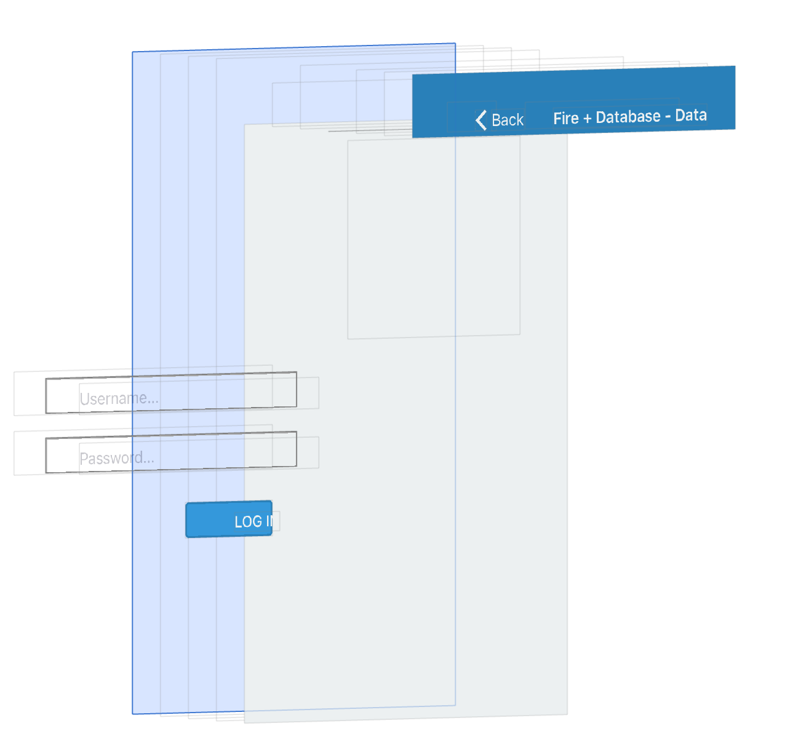

# AC3.2-MidUnit-6-Exam
---


### Animations

If you're like me (and I know you are), you must be craving for a login screen to use for authenticating Firebase users. It keeps me up at night, and I don't want to let that happen to you! So, this problem will look at adding in a series of simple animations to liven-up a login screen for our app, **Fire + Database - Data**. 

A lot of code has been provided for you so that you may focus on getting the animations just right. When you fork this repo, take a moment to look over the code that is written in `AnimationsViewController`. You shouldn't need to change anything in the sections that are marked, but you may temporarily comment out code if you find it useful to debug. Just make sure to uncomment that code before submitting your final PR. 

**FINAL PRODUCT YOU MUST HAVE FOR FULL CREDIT:**

[See final animations by clicking here!](https://gfycat.com/SimilarFlawedAchillestang)

---

### Where to begin:

I suggest looking at your view hierarchy debugger to get a sense for where stuff is. To help you out, here are some screenshots of the project right now:

#### Looking straight ahead:


#### Looking at an angle:


#### Best Advice:

*Don't try to do everything at once*

Break down the task into its smaller components. For example, you could start with just the [scale & fade of the logo (click me to view).](https://gfycat.com/WellinformedMinorBordercollie). After you have that working, move onto the first `containerView` and get the [sliding animation working (click me to view)](https://gfycat.com/HarmfulCheapKusimanse). Then, get the [password `containerView` working](https://gfycat.com/VerifiableInnocentCrow). 

---

### Double Video

> It was a dark and stormy night. You're living in a 1:1 map of the world. Tautologies surround you. 
> You have to write an app that's has no other purpose than to be what it is. A sense of Zen-like 
> calm suffuses your existence. You rise to face the challenge.

You can ignore the above paragraph.

The object is to pick a video out of your library and display it in one of the two positions
available (top or bottom) in the view controller. The rules for picking where to place it are as
follows. 

1. Look for the first available slot that is either empty or not currently playing. 
1. Put the video in that position and play it.
1. If both positions have a currently playing video then do nothing.

#### Guide

1. There is a nib DoubleVideoViewController.xib already in place. You should not need to change it.
1. You should only need to make edits in DoubleVideoViewController.swift for this portion of the exam.
1. Use ```UIImagePickerController``` to pick the video from the library.
1. Use the ```AVPlayerItem```, ```AVPlayer```, and ```AVPlayerLayer``` objects to take the chosen
	video and display it. Remember,```imagePickerController(_:didFinishPickingMediaWithInfo:)``` 
	will give you a URL for Movies and that can be used to construct an ```AVPlayerItem```.
1. You can determine whether a video is currently playing by checking the ```rate``` property of 
	the ```AVPlayer``` object. No keys or values need be harmed (or even observed)
	during the making of this app. (Plain English: No KVO needed).
1. It's **ok** if your videos stack up inside the container views, but clear them out if you
	have extra time. See Bonus.
1. You'll need a video or two of some length (30s or longer) in order to easily test the conditions
	where the first or both positions are currently playing. Video can be loaded into the simulator
	simply by dragging a .mov file from the Finder into the Photos app on the simulator. Let a proctor
	know if you can't get a video into your simulator.

#### Fairly Adequate Advice

As Louis advises, try to approach the problem incrementally as always. Get one video to work first.
Go ahead and commit that version -- you may want to come back to it. Then move on to two videos.

#### Bonus

1. Use some data structure(s) to manage the two players and their associated views.
1. Clear out old ```AVPlayerLayer```s before adding new ones so videos don't stack up.
1. If both positions have a currently playing video then use ```UIAlertController``` to
	alert the user that no spot is currently available. This is trickier than it seems.